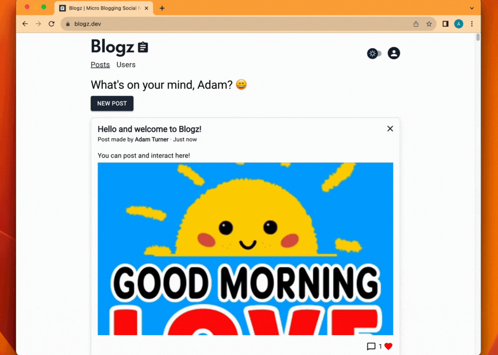

# Blogz | MERN Stack Social Network Project

Blogz is a dynamic MERN stack social network application.

The React UI offers views for Blogs and Users, managed by Redux for smooth state handling.

On the backend, Node and Express manage routes for user actions like blog creation, updates, and deletion, along with commenting and liking, with the addition of GIPHY API integration, enabling users to post or comment with GIFs from a library.

User data is securely stored in MongoDB with Mongoose.

Integration testing with Supertest ensures robust APIs, and user authentication relies on JWT and Bcrypt.

# Screenshots



# Demo

To trial the application simply [click here](https://blogz.dev) and use the following credentials:

Username: **demo**  
Password: **demo**

Or register for your own account at [https://blogz.dev/register](https://blogz.dev/register).

# Tech Stack

## Frontend:

- Blogz features a React frontend written in JavaScript.
- Frontend unit testing is ensured with Jest and React Testing Library.
- The application boasts a polished and modern UI, achieved using MaterialUI components with a dark mode option.
- Redux is implemented for efficient state management, enabling smooth interactions and data handling.

## Backend:

- Node and Express backend that handles various routes, including retrieving, creating, updating, and deleting blogs, as well as user registration, login, commenting, and liking functionalities.
- MongoDB with Mongoose serves as the database, storing Users and Blogs data with a structured schema.
- The backend is subjected to integration testing using Supertest, ensuring reliable API endpoints.
- User Authentication is prioritized and enforced with JWT (JSON Web Tokens) and Bcrypt.

## Installation

To install and run this project locally please do the following:

Change directory to the frontend folder and run the following command. Do the same with the backend folder:

```bash
  npm install
```

## Environment Variables

Register for an account with [MongoDB Atlas](https://www.mongodb.com/atlas/database) and set up a database with adequate user credentials, store the details for the database, default port and secret for bcrypt as follows in a .env file within the root of the backend folder:

```
MONGODB_URI="Your Mongo DB URI"
PORT=3004
SECRET="Any secure string for hashing the passwords can go here"
```

Register for a developer account with [GIPHY API](https://developers.giphy.com/), once you obtain an API key you will need to place that in a .env file within the root of the Frontend folder as below, the port is specified for running locally:

```
PORT=3005
REACT_APP_GIPHY_API_KEY="API KEY HERE"
```

## Run Locally

Once you have followed the installation steps, change directory to the backend folder. Run the following command, doing the same for the frontend shortly after:

```
npm start
```

Visit [http://localhost:3005](http://localhost:3005) once you have completed the above steps.

# Build

To build the frontend of this project you will need to create a production build and find an adequate server environment, the latter of which is out of the scope of this readme.

## Available Build Commands

**Building the User Interface (UI)**

Create a production-ready build of the frontend and copy it to the backend.

```bash
npm run build:ui
```

Deploying the Full Application

**Build the UI and push the changes to the main branch of the repository**

```bash
npm run deploy:full
```

**Starting the Production Server**

```bash
npm start
```

**Starting the Test Server**

```bash
npm run start:test
```

**Starting the Development Server**

```bash
npm run dev
```

[](https://blogz.dev)
